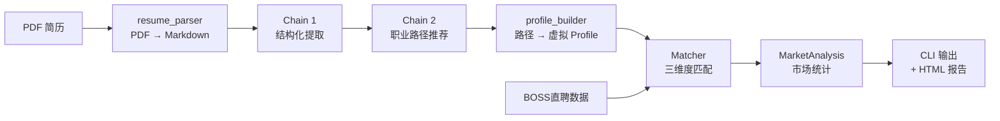

# Job Detect

> 求职决策 CLI — 不是搜索工具，是决策工具

Job Detect 是一个命令行工具，基于 AI 简历分析 + BOSS直聘岗位数据，给出**职业路径推荐、匹配评分、市场分析和技能差距报告**，帮助你在求职过程中做出更好的决策。

## 功能概览

- **AI 简历分析** — 上传 PDF 简历，自动提取技能、经历、亮点
- **职业路径推荐** — AI 基于简历背景推荐 1-5 条差异化职业方向
- **岗位匹配排名** — 技能/经验/薪资三维度加权打分，按综合分数排序
- **市场分析** — 城市分布、薪资统计、热门技能频率
- **技能差距** — 统计高频缺失技能，给出优先学习建议
- **可视化报告** — 一键生成深色主题 HTML 报告，含三维评分条和岗位卡片
- **交互式配置** — `init` 命令引导生成用户配置文件

## 架构



```
src/
├── ai/
│   ├── chains.py            # LLM 调用（GLM-4-flash + 手动 JSON 解析）
│   ├── prompts.py            # LangChain Prompt 模板
│   ├── schemas.py            # AI 输出的 Pydantic 模型
│   ├── resume_parser.py      # PDF → Markdown（pymupdf4llm）
│   └── profile_builder.py    # 职业路径 → 虚拟用户 Profile
├── analysis/
│   ├── matcher.py            # 岗位匹配器
│   ├── recommender.py        # 推荐排序 + 技能差距报告
│   └── market.py             # 市场分析
├── cli/
│   └── main.py               # CLI 入口（Typer 命令定义）
├── core/
│   ├── scorer.py             # 可插拔评分器 + 规则引擎
│   ├── normalizer.py         # 技能别名归一化
│   ├── salary_parser.py      # 薪资字符串解析
│   └── experience_parser.py  # 经验字符串解析
├── data/
│   ├── models.py             # Pydantic 数据模型
│   ├── loader.py             # JSON 数据加载器
│   └── profile.py            # YAML 用户配置加载
├── report/
│   └── html_report.py        # HTML 可视化报告生成
└── config/
    └── skill_aliases.yaml    # 技能别名映射表
```

## 评分算法

综合分数由三个信号加权求和：

```
总分 = w_skill × 技能重叠度 + w_exp × 经验匹配度 + w_salary × 薪资契合度
默认权重: 技能 40%、经验 30%、薪资 30%
```

当某个信号无法计算时（如岗位薪资标注"面议"），该信号权重按比例**重分配**到其他信号。

## 安装

```bash
git clone <repo-url>
cd job-detect

python -m venv .venv
source .venv/bin/activate  # Windows: .venv\Scripts\activate

pip install -e ".[dev]"
```

需要 AI 功能时，设置环境变量：

```bash
export ZHIPU_API_KEY=your_key_here
```

## 快速开始

### 方式一：简历驱动（推荐）

```bash
# 上传简历 → AI 分析 → 职业路径推荐 + 市场匹配
job-detect advisor --resume data/resumes/resume.pdf --data data/jobs.json

# 同时生成可视化 HTML 报告
job-detect advisor -r data/resumes/resume.pdf -d data/jobs.json --html

# 只做简历分析（不需要岗位数据）
job-detect advisor -r data/resumes/resume.pdf

# 自定义路径数量
job-detect advisor -r resume.pdf -d jobs.json --paths 5 --top 10
```

### 方式二：配置文件驱动

```bash
# 交互式生成配置
job-detect init --output profile.yaml

# 完整分析
job-detect analyze --data data/jobs.json --profile profile.yaml

# 仅匹配排名
job-detect match -d data/jobs.json -p profile.yaml --top 10

# 市场概览（不需要配置文件）
job-detect market --data data/jobs.json --keyword Python
```

### 数据采集

使用 `scripts/fetch_jobs.py` 从 BOSS直聘批量采集岗位数据：

```bash
# 先登录
boss login

# 运行采集（5 个城市 × 4 个关键词）
python scripts/fetch_jobs.py
```

支持的数据格式：

- boss-cli envelope: `{"ok": true, "data": {"jobList": [...]}}`
- boss-cli flat list: `{"ok": true, "data": [...]}`
- 纯数组: `[{"jobName": "...", ...}, ...]`
- 单对象: `{"jobName": "...", ...}`

## 命令参考

| 命令 | 说明 | 必需参数 |
|------|------|----------|
| `advisor` | 简历驱动：AI 分析 → 职业路径 → 岗位匹配 | `--resume` |
| `analyze` | 完整分析：排名 + 技能差距 + 市场 | `--data`, `--profile` |
| `match` | 仅输出匹配排名 | `--data`, `--profile` |
| `market` | 市场概览（无需配置） | `--data` |
| `init` | 交互式生成配置文件 | — |

### advisor 选项

| 选项 | 说明 | 默认值 |
|------|------|--------|
| `--resume, -r` | 简历 PDF 路径 | 必填 |
| `--data, -d` | 岗位数据 JSON（省略则只做简历分析） | `""` |
| `--paths, -p` | 推荐职业路径数量 | `3` |
| `--top, -t` | 每条路径显示前 N 个匹配岗位 | `10` |
| `--html` | 同时生成可视化 HTML 报告 | `false` |

### 通用选项

| 选项 | 说明 | 默认值 |
|------|------|--------|
| `--data, -d` | JSON 数据文件路径 | 必填 |
| `--profile, -p` | YAML 配置文件路径 | 必填 |
| `--top, -t` | 显示前 N 条推荐 | `20` |
| `--min-score` | 最低匹配分数过滤 | `0` |
| `--keyword, -k` | 关键词过滤（market 命令） | `""` |

## 开发

```bash
pytest                  # 运行测试（113 个用例）
ruff check src/ tests/  # Lint
ruff format src/ tests/ # 格式化
```

## 技术栈

| 类别 | 技术 |
|------|------|
| 语言 | Python 3.10+ |
| CLI | Typer + Rich |
| 数据模型 | Pydantic v2 |
| AI | LangChain + GLM-4-flash（智谱） |
| 简历解析 | pymupdf4llm |
| 配置 | PyYAML |
| 测试 | pytest + ruff |

## License

MIT
