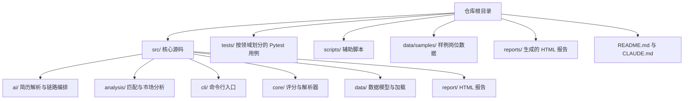

# AGENTS.md 贡献指南分析

## 目标

为仓库新增 `AGENTS.md`，生成一份简洁、可执行、面向贡献者的仓库指南，帮助协作者快速理解目录、命令、测试、风格与提交要求。

## 仓库事实整理

- 项目名称：`job-radar`
- 语言与运行时：Python 3.10+
- 构建工具：`hatchling`
- CLI 入口：`job-radar = "src.cli.main:app"`
- 代码目录：`src/`
- 测试目录：`tests/`
- 脚本目录：`scripts/`
- 样例数据：`data/samples/`
- 报告输出：`reports/`
- 质量工具：`pytest`、`pytest-cov`、`ruff`

## 目录关系

## 文档内容规划

### 1. Project Structure & Module Organization

说明 `src/`、`tests/`、`scripts/`、`data/samples/`、`reports/` 的职责，并点出 `tests/` 与 `src/` 的领域映射关系。

### 2. Build, Test, and Development Commands

优先列出仓库中真实存在且高频的命令：

- `pip install -e ".[dev]"`
- `pytest`
- `pytest tests/core/test_scorer.py -x`
- `ruff check src/ tests/`
- `ruff format src/ tests/`
- `python -m src.cli.main --help`

### 3. Coding Style & Naming Conventions

基于现有配置与仓库约定，总结：

- 使用 Python 3.10+
- 行宽 100
- 包导入使用绝对路径
- 源码按领域拆分到 `src/<domain>/`
- 测试文件命名为 `test_*.py`

### 4. Testing Guidelines

强调：

- 统一使用 `pytest`
- 测试放到 `tests/` 对应子目录
- 优先补充核心解析、评分、CLI 与 AI 适配层的边界场景

### 5. Commit & Pull Request Guidelines

从 git 历史归纳简洁规则：

- 提交前缀常见为 `feat:`、`refactor:`
- 建议继续使用祈使式摘要
- PR 需说明行为变化、测试结果、配置影响

### 6. Security & Configuration Tips

补充：

- AI 能力依赖 `ZHIPU_API_KEY`
- 真实简历、岗位数据与生成报告不应提交
- 优先使用 `data/samples/` 进行示例与测试

## 约束

- 最终文档标题必须为 `Repository Guidelines`
- 控制在 200 到 400 词左右
- 语气专业、简洁、可执行
